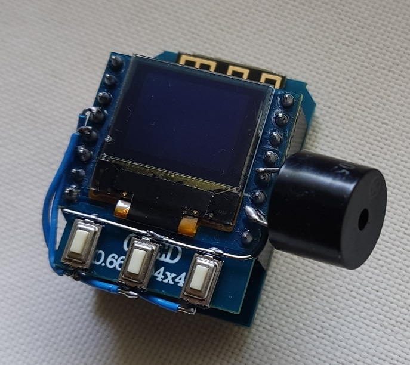
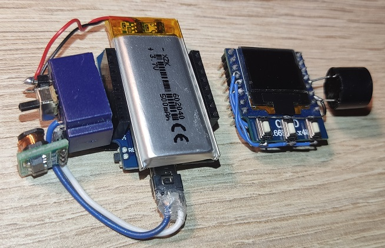
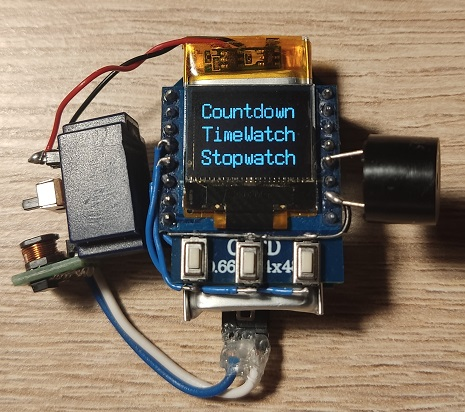

# Mein Clock

 - Time Watcher: Device beeps every hour (2 long beeps), half an hour (1 long beep), 10min (1 or 2 short beeps)
 - Timer: countdown to 00:00. E.g. kitchen timer with predefined intervals for preparing eggs, coffee etc.
 - Beeping on some schedule
 - Stopwatch
 

## Test device (parts)

## Test device (assembled)

